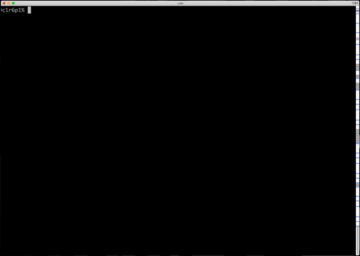

# N-puzzle

N-Puzzle is a project at Hive (Helsinki) coding school.

## 1. Project description

### 1.1 A goal of the project

The goal of this project is to solve the N-puzzle game using the A\* search algorithm or one of its variants.
You start with a square board made up of N*N cells. One of these cells will be empty,
the others will contain numbers, starting from 1, that will be unique in this instance of
the puzzle.
Your search algorithm will have to find a valid sequence of moves in order to reach the
final state, a.k.a the "snail solution", which depends on the size of the puzzle (Example
below). While there will be no direct evaluation of its performance in this instance of the
project, it has to have at least a vaguely reasonable perfomance : Taking a few second to
solve a 3-puzzle is pushing it, ten seconds is unacceptable.

**3x3 Puzzle**
||||
|-|-|-|
|1|2|3|
|8||4|
|7|6|5|

**4x4 Puzzle**
|||||
|-|-|-|-|
|1|2|3|4|
|12|13|14|5|
|11||15|6|
|10|9|8|7|

**5x5 Puzzle**
||||||
|-|-|-|-|-|
|1|2|3|4|5|
|16|17|18|19|6|
|15|24||20|7|
|14|23|22|21|8|
|13|12|11|10|9|

The only move one can do in the N-puzzle is to swap the empty cell with one of its
neighbors (No diagonals, of course. Imagine you’re sliding a block with a number on it
towards an empty space).

### 1.2 Visualization of 3x3 Puzzle algorithms

Here is a link to a page which demonstrate (visualize) solutions for solving 3x3 Puzzle. The page is not related to the Hive N-Puzzle project.
* https://tristanpenman.com/demos/n-puzzle/

### 1.3 Ready made script for creating input (N-puzzle) for a solution

## 2. My Solution

### 2.1 Solution description

[Link to Solution description (PPT)](https://onedrive.live.com/embed?resid=7AEA86BDEF93781E%2178221&amp;authkey=%21AI75ceSh6FeMjX0&amp;em=2&amp;wdAr=1.7777777777777777)

#### 2.1.1 Visualized solution descriptions

* N-Puzzle creator

* [N-Puzzle solver]()
* [N-Puzzle tile move visualizer]()
* [Database (Influxdb)]()
* [Stat visualizer (Grafana)]()

### 2.2 Implemented search algorithms

| Based on | Algorithm name | Abbreviation| Description | Refer to |
| :- | :- | :-: | :- | - |
|**DFS**|
|| DFS Random | dfs_1 | Depth-first search (DFS) with random selection of next move ||
|| DFS Deeping | dfs_2 | Depth-first search (DFS). Depth is increased step by step until solution of a puzzle is reached ||
|| DFS Deeping mem | dfs_3 | Depth-first search (DFS). Like dfs_2, but all N-puzzle states are saved which avoid tile moves already verified direction ||
|**BFS**|
|*Linked list*| BFS List | bfs_1 | Breadth-first search (BFS) with all visited N-puzzle states are saved in a linked list ||
|*B-Tree*| BFS B-tree | bfs_2 | Breadth-first search (BFS) with all visited N-puzzle states are saved in a B-tree ||
| **A*** | A* with taxicab (hardcoded heuristic algorithm) | a_star_t | | [A* search algorithm](https://en.m.wikipedia.org/wiki/A*_search_algorithm) |
| **IDA*** | IDA* with a heuristic algorithm | ida | IDA* based a search with a heuristic algorithm and path cost priorize tile moves. | [Iterative deepening A*](https://en.m.wikipedia.org/wiki/Iterative_deepening_A*) |
| **Uniform-cost search** | UCS | ucs | Selection of the next move is based on a cost from an initial (root) state. A lowest value is the first in a priority queue. | [What is uniform-cost search?](https://www.educative.io/edpresso/what-is-uniform-cost-search) |
| **Greedy search** |  | g | Greedy is based a search with a heuristic algorithm (only) priorize tile moves. Taxicab is a default algorithm (the param -H) | |

### 2.3 Implemented heuristic algorihms

| Algorithm | Abbreviation| Description | Refer to |
| :- | :-: | :- | -|
|**Hamming distance** (Tiles out of place) |h| Selcection of the next move is based a number of tiles out of the right place. A lowest value is the first in a priority queue. | [Hamming distance](https://en.wikipedia.org/wiki/Hamming_distance) |
| **Taxicab geometry** (Manhattan distance) | t | Selection of the next move is based a sum of tiles absolute distances (cartesian distance) from the right place. A lowest value is the first in a priority queue. | [Taxicab geometry](https://en.m.wikipedia.org/wiki/Taxicab_geometry) |
| **Taxicab geometry with direct reversal of tiles penalty** | tr | Selection of the next move is based to taxicab geometry and direct reversal of tiles. A lowest value is the first in a priority queue. | [Taxicab geometry](https://en.m.wikipedia.org/wiki/Taxicab_geometry)|

### 2.4 Implemented N-puzzle search algorithm

| Function | Function name | Description | Refer to |
| :- | :- | :- | :- |
| n_puzzle_search_algorithm | n_puzzle_search_algorithm | Searches all possible tile move alternatives from an n-puzzle state. The function is used for higher-level algorithms (A*, IDA*, etc.) as input (the next possible n-puzzle states). | |

### 2.5 Implemented N-Puzzle specific functions

| Function | Function name | Description | Refer to |
| :- | :- | :- | :- |
| **Is N-Puzzle solvable** | is_puzzle_solvable | Verifies is N-puzzle initail state solvable. | [Check if 15 puzzle is solvable](https://stackoverflow.com/questions/34570344/check-if-15-puzzle-is-solvable) |

### 2.6 Implemented utilities

| Function | Function name | Description | Refer to |
| :- | :- | :- | :- |
| **Stack** | | **Push/Pop data to/from a stack** | [Stack (abstract data type)](https://en.wikipedia.org/wiki/Stack_(abstract_data_type)) |
| | ft_stack_push | Push data to a stack | |
| | ft_stack_pop | Pop data from a stack | |
| **Queue** | | **Push/Pop data to/from a queue** | [Queue (abstract data type)](https://en.wikipedia.org/wiki/Queue_(abstract_data_type)) |
| | ft_enqueue | Push data to a queue | |
| | ft_dequeue | Pop data from a queue | |
| **B-Tree** | | **Save data to a B-Tree** | [B-Tree](https://en.wikipedia.org/wiki/B-tree) |
| | ft_bt_insert | Push data to a B-Tree | |
| | ft_bt_find | Find data from a B-Tree | |
| | ft_bt_print | Print all data (keys) from a B-Tree | |
| | ft_bt_delete | Delete all data from a B-Tree | |
| **Prio Queue** | | **Save data to a priorized queue** | |
| | ft_prio_enqueue | Push data to a queue | |
| | ft_prio_dequeue | Pop data from a queue | |
| **Event logging** | | Print events to stderr during a program execution. A logging level (five levels) could be specified in input argument (-L) | Based on [A simple logging library implemented in C99](https://github.com/rxi/log.c)|
| | FT_LOG_\<level\>| level = TRACE, DEBUG, INFO, WARN, ERROR, FATAL.  Logging level TRACE (0) print all kind of events to stderr during execution of a program. A default value is WARN (3). | |

## 2.7 Adapted (modified) open source programs

| Function | Function name | Description | Refer to |
| :- | :- | :- | :- |
| **N-Puzzle GUI** | | **Visualize tile moves in N-Puzzle** | Based on [Welcome to N-Puzzle](https://pyinmyeye.blogspot.com/2012/07/tkinter-15-puzzle-demo-placer-geometry.html) |

## 3. Installation

### 1. Verify prerequisites

python2 --version
>Should be like:
Python 2.xxxxx

python3 --version
>Should be like:
Python 3.xxxxx

docker --version
>Should be like:
Docker version 20.10.5, build 55c4c88

docker-compose --version
>Should be like:
docker-compose version 1.29.0, build 07737305

### 2. Clone the project from github

git clone https://github.com/jussihyva/n-puzzle.git

### 3. Compile and start docker containers

cd n-puzzle
>NOTE. make command might fail without sudo command (sudo make). This becuse of usage of Docker requires admin rights (sudo) in some environments.

make

### 4. Verify installation

./bin/n_puzzle -h

>Reply should be something like this:
11:14:04.199 ERROR src/arg_parser.c:17: Unknown parameter: -h

## 4. Use cases

## 5. Examples

### 5.1 N-Puzzle input creator

### 5.2 N-Puzzle solver (My Solution)

### 5.2 N-puzzle GUI (Modified in my solution)

## 6. Lessons learned

### 6.1 Stack, Queue, B-Tree and Prio-Queue

Some details, what exactly I learned.

### 6.2 BFS (Breadth-First Search)

Some details, what exactly I learned.

### 6.3 DFS (Depth-First Search)

Some details, what exactly I learned.

### 6.4 Heuristic Algorithms related to N-puzzle

#### 6.4.1 Tiles-Out-Of-Place

Some details, what exactly I learned.
